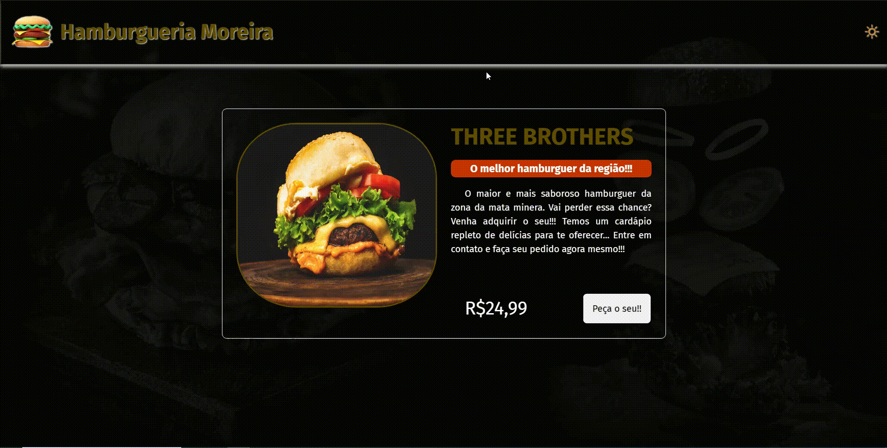

# Projeto - Dark mode
Um projeto que conta um pouco sobre Dark mode de uma hamburgueria com um lanche oferecido pela empresa, buscando demonstrar minhas habilidades com a programação através do acionamento de um botão que muda a cor de fundo e também algumas propriedades de alguns componentes do projeto. 🚀❤🙌

[]

## Tecnologias utilizadas 🚀
- HTML5
- CSS3
- JAVASCRIPT
- PHOTOSHOP

## Por que desenvolvi o projeto?
Este trabalho foi desenvolvido com o intuito de demonstrar minhas habilidades com a programação por meio da elaboração de um dark mode para uma hamburgueria através de um de seus lanches oferecidos. O projeto demonstra mudança de coloração de alguns de seus componentes, exibindo a funcionalidade e eficácia do projeto. Elaborei sua arte e design utilizando o photoshop. Espero que curtem e ajude compartilhando!!!

Feito com ❤ por Flávio Dias Moreira 👏 [Veja meu LinkedIn](https://www.linkedin.com/in/fl%C3%A1vio-dias-moreira-89102a218/)